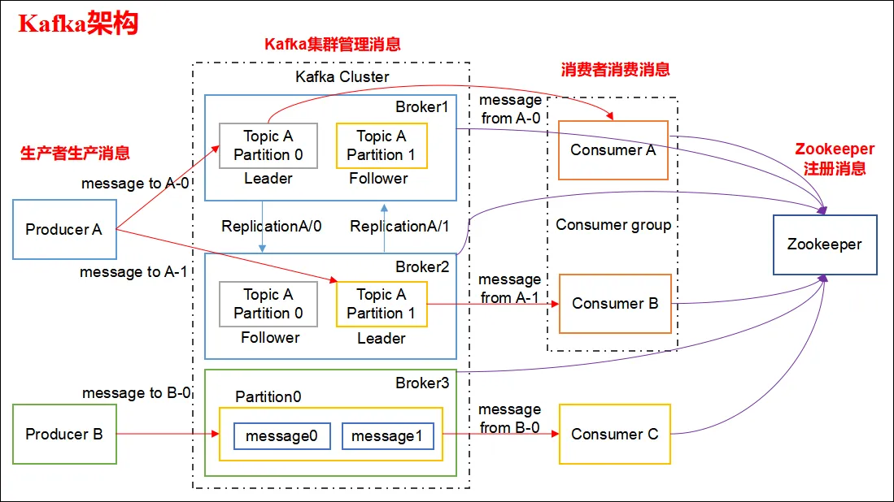

# ✅Kafka为什么依赖Zookeeper，有什么用？

# 典型回答


[✅Kafka的架构是怎么样的？](https://www.yuque.com/hollis666/ukxanr/glnsckpypwycgh54)


在上面的文章中我们介绍过Kafka的架构，这里面有个很关键的组件，是Zookeeper。（<u>但是后来被移除了，详见后文</u>）





ZooKeeper是Kafka集群中使用的分布式协调服务，用于维护Kafka集群的状态和元数据信息，例如主题和分区的分配信息、消费者组和消费者偏移量等。 展开说就是有以下这些功能：


### 集群管理


Zookeeper 负责管理 Kafka 集群中的所有 Broker，当有 Broker 加入或退出时，Zookeeper 负责通知其他组件，让 Kafka 及时更新集群信息。 


实现原理：当 Kafka 的 Broker 启动时，会在 Zookeeper 创建一个**临时节点**。如果 Broker 崩溃或断开连接，临时节点会自动删除，其他组件能感知到这个 Broker 不再可用。  


```plain
/brokers/ids/{broker_id}
```


 该节点会存储 Broker 的 host、port 信息，这样其他 Broker 或客户端可以从 Zookeeper 获取 Broker 列表。  


### 分区和副本管理


kafka的数据存储是基于分区和副本的，zk则负责存储这些分区的元数据，包括：


+ 该分区有哪些副本（Replicas）
+ 哪个副本是 Leader，哪些是 Follower
+ 副本的 ISR（In-Sync Replica，即同步副本集合）列表


[✅介绍一下Kafka的ISR机制？](https://www.yuque.com/hollis666/ukxanr/sysbmls6p386aow0)


实现原理： Kafka 在 `/brokers/topics/{topic_name}/partitions/{partition_id}/state` 目录下存储每个分区的 **Leader、副本、ISR（In-Sync Replica）列表**。  


```plain
/brokers/topics/topic1/partitions/0/state
```


存储内容大致为：


```plain
{
  "leader": 1001,
  "replicas": [1001, 1002, 1003],
  "isr": [1001, 1002]
}
```


**Broker 会监听监听这个节点**，当 Leader 发生变化时，Kafka 通过 Zookeeper 通知所有相关 Broker 更新 Leader 信息。  


### Controller选举


[✅Kafka 几种选举过程简单介绍一下？](https://www.yuque.com/hollis666/ukxanr/nk4ld4)


Kafka 依赖 Zookeeper 来进行 **Controller 选举**。Controller 负责管理整个 Kafka 集群中的Partition和副本（Replica）。如果当前 Controller 崩溃，Zookeeper 会帮助选出新的 Controller，以确保集群正常运行。 

 

实现原理：当要开始进行Controller 选举时，每个 Broker 争抢创建 `/controller` 节点。**第一个成功创建 **`**/controller**`** 节点的 Broker 就成为 Controller**。当 Controller 崩溃时，Zookeeper 立即删除该临时节点，其他 Broker 重新发起选举。


### Broker配置信息
Kafka中Broker 的一些配置信息（如主题的创建、删除、修改）可以存储在 Zookeeper 中，并由 Zookeeper 负责通知集群中的其他 Broker 进行更新。  


# 扩展知识


## zk被移除


从 Kafka 2.8.0 开始，Kafka 引入了 **KRaft（Kafka Raft）协议**，尝试摆脱对 Zookeeper 的依赖。主要目的是：


1. **减少依赖，简化运维**：Zookeeper 需要单独部署和维护，使用自己的KRaft，可以直接管理元数据，降低系统复杂度。
2. **提升可扩展性**：Zookeeper 在大规模 Kafka 集群中的性能可能会成为瓶颈，而 KRaft 通过更高效的元数据管理方式提升了扩展能力。
3. **加快故障恢复**：KRaft 采用 Raft 选举方式，相比 Zookeeper 选举 Controller 速度更快，提高了 Kafka 的可用性。


在2025-3-19日，Kafka 4.0发布后（[https://archive.apache.org/dist/kafka/4.0.0/RELEASE_NOTES.html](https://archive.apache.org/dist/kafka/4.0.0/RELEASE_NOTES.html) ），则默认采用JRaft模型运行，不再依赖Zk。


> 更新: 2025-03-22 10:35:05  
> 原文: <https://www.yuque.com/hollis666/ukxanr/eobdd8io8hg44muh>