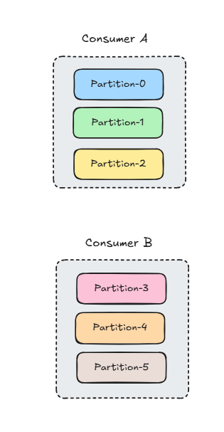
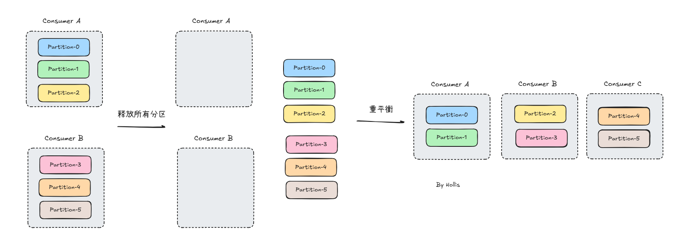
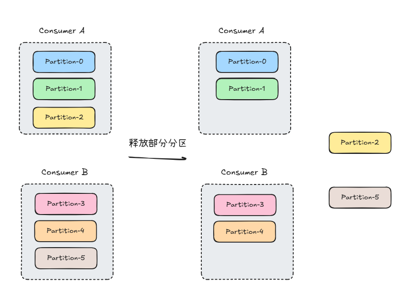
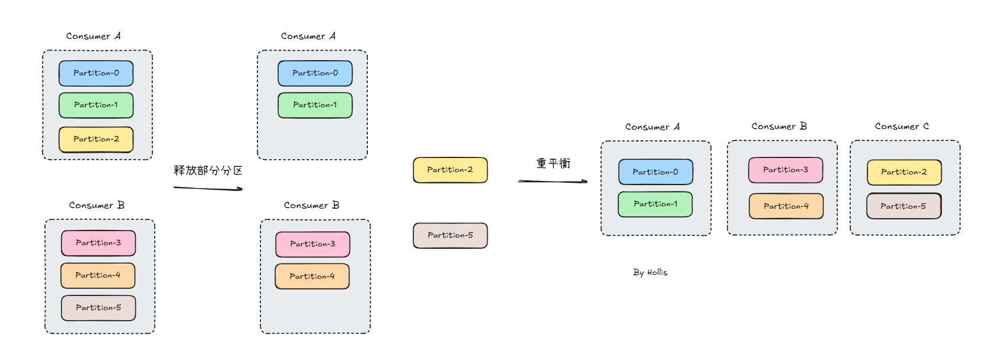

# ✅什么是Kafka的渐进式重平衡？

# 典型回答


重平衡的问题大家都知道，他会导致STW，所以大家都不希望他发生，或者希望他能把影响降到最低。


[✅什么是Kafka的重平衡机制？](https://www.yuque.com/hollis666/ukxanr/rqzepcxvq2a1w2e9)


然后有一种优化方案是渐进式重平衡，目的是在进行消费者组重平衡时，**尽可能减少数据中断和不必要的分区变更**。它由 **Cooperative Sticky Assignor**提供支持，并在 Kafka 2.4.0 引入。  


开启方式：


```plain
props.put("partition.assignment.strategy",
          "org.apache.kafka.clients.consumer.CooperativeStickyAssignor");
```


开启了CooperativeStickyAssignor之后，Kafka 通过 **两阶段分配** 机制实现渐进式重平衡，下面举个例子，假设有一个topic，共6个partition，一个消费者，其中有两个消费者再消费数据：





这时候有一个新的消费者加入，就需要重平衡。


如果是传统重平衡方式，Kafka 会：

1. 让 **ConsumerA 和 ConsumerB 释放所有分区**（完全停止消费）。
2. Kafka 重新分配 P0 ~ P5 给 ConsumerA、ConsumerB、ConsumerC。
3. 消费者重新开始消费（期间完全中断）





而如果是渐进式重平衡，则采用2阶段方式。


第一阶段：部分撤销


+ **ConsumerA 和 ConsumerB 不会释放所有分区，而是部分释放。**
+ Kafka 计算 **最小变更** 方案，并决定 ConsumerA、ConsumerB 各释放一个分区，给 ConsumerC 用。即可能是**ConsumerA** 释放 Partition-2；ConsumerB 释放 Partition-5





第二阶段：重新分配

+ Kafka 重新分配被释放的分区，则 ConsumerC 消费 Partition-2 和 Partition-5





这么样的重平衡过程，就可以减少所有分区都停止消费的情况，而只有其中部分分区需要重新分配而已。以上使用增加消费者的方式距离的，如果是减少消费者其实也一样。只有移除的消费者释放自己的分区，再重新分配给其他分区就好了，其他分区自己的那部分不用改变。


> 更新: 2025-03-22 11:01:17  
> 原文: <https://www.yuque.com/hollis666/ukxanr/kpvazhtr1ukqoyx7>