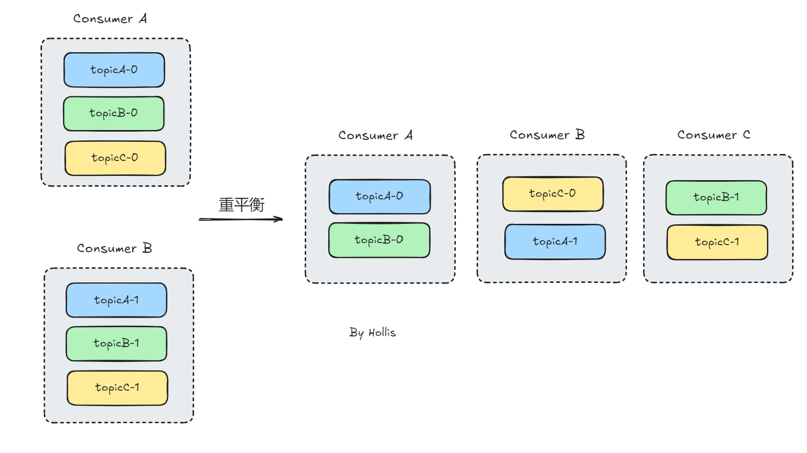
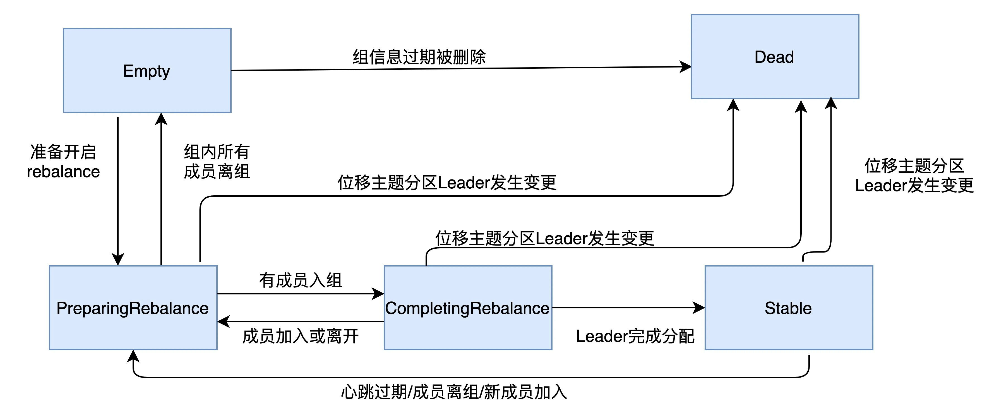

# ✅什么是Kafka的重平衡机制？

# 典型回答

Kafka 的重平衡机制是指在消费者组中新增或删除消费者时，Kafka 集群会重新分配主题分区给各个消费者，以保证每个消费者消费的分区数量尽可能均衡。

重平衡机制的目的是实现消费者的负载均衡和高可用性，以确保每个消费者都能够按照预期的方式消费到消息。

**重平衡的 3 个触发条件：**

+ 消费者组成员数量发生变化。（新消费者的加入或者退出）
+ 订阅主题（Topic）数量发生变化。
+ 订阅主题的分区（Partition）数发生变化。

还有**两种异常情况**：

+ 组协调器（Group Coordinator） 是 Kafka 负责管理消费者组的 Broker 节点。如果它崩溃或者发生故障，Kafka 需要重新选举新的 `Group Coordinator`，并进行重平衡。
+ 当消费者组中的 Leader 消费者崩溃或退出。Kafka 需要选举新的 Leader，重新进行重平衡。

当Kafka 集群要触发重平衡机制时，大致的步骤如下：

1. **暂停消费**：在重平衡开始之前，Kafka 会暂停所有消费者的拉取操作，以确保不会出现重平衡期间的消息丢失或重复消费。

2. **计算分区分配方案**：Kafka 集群会根据当前消费者组的消费者数量和主题分区数量，计算出每个消费者应该分配的分区列表，以实现分区的负载均衡。

3. **通知消费者**：一旦分区分配方案确定，Kafka 集群会将分配方案发送给每个消费者，告诉它们需要消费的分区列表，并请求它们重新加入消费者组。

4. **重新分配分区**：在消费者重新加入消费者组后，Kafka 集群会将分区分配方案应用到实际的分区分配中，重新分配主题分区给各个消费者。

5. **恢复消费**：最后，Kafka 会恢复所有消费者的拉取操作，允许它们消费分配给自己的分区。

Kafka 的重平衡机制能够有效地实现消费者的负载均衡和高可用性，提高消息的处理能力和可靠性。但是，由于重平衡会带来一定的性能开销和不确定性，因此在设计应用时需要考虑到重平衡的影响，并采取一些措施来降低重平衡的频率和影响。

**在重平衡过程中，所有 Consumer 实例都会停止消费，等待重平衡完成。但是目前并没有什么好的办法来解决重平衡带来的STW，只能尽量避免它的发生。**

****

****

# 扩展知识

## 消费者的五种状态

Kafka的Consumer实例五种状态，分别是：

| 状态 | 描述 |
| --- | --- |
| Empty | 组内没有任何成员，但是消费者可能存在已提交的位移数据，而且这些位移尚未过期 |
| Dead | 同样是组内没有任何成员，但是组的元数据信息已经被协调者端移除，协调者保存着当前向他注册过的所有组信息 |
| PreparingRebalance | 消费者组准备开启重平衡，此时所有成员都需要重新加入消费者组 |
| CompletingRebalance | 消费者组下所有成员已经加入，各个成员中等待分配方案 |
| Stable | 消费者组的稳定状态，该状态表明重平衡已经完成，组内成员能够正常消费数据 |

状态的流转过程：

## 优化重平衡

重平衡会导致STW，应尽量减少问题发生，可以有以下几种优化方式，

默认情况下，消费者离开后会导致重平衡。但如果开启**静态成员**，Kafka 不会立即移除该消费者，而是等待一段时间（`group.instance.id`）。   这样，如果消费者重启，Kafka 仍然保持它的分区分配，不触发重平衡。 

还有就是，Kafka 提供了多种分区分配策略，选择合适的策略可以减少重平衡的影响：

+ **RangeAssignor**（默认）：基于 `range` 分配，可能导致不均衡。
+ **RoundRobinAssignor**：轮询分配，适用于均匀分布的消费者。
+ **StickyAssignor**：优先保持之前的分区分配，**减少重平衡。**
+ **CooperativeStickyAssignor**：**渐进式重平衡，不会影响所有消费者**，只影响变更的部分。

## 4.0优化

在最新发布的4.0版本中（2025-03-19），提出了下一代消费者重平衡协议（[https://cwiki.apache.org/confluence/display/KAFKA/KIP-848%3A+The+Next+Generation+of+the+Consumer+Rebalance+Protocol](https://cwiki.apache.org/confluence/display/KAFKA/KIP-848%3A+The+Next+Generation+of+the+Consumer+Rebalance+Protocol)）

一方面将分区分配逻辑从客户端移到了服务端，简化客户端更加简单，而且这样服务端也能从全局视角更好的处理重平衡。

另外有个比较大的改进，就是允许消费者独立于其他成员进行重平衡了，这就意味着当一个消费者发生变化时，不再需要暂停整个组，其他消费者可以继续正常工作，提高了系统的可靠性和扩展性。  

## 重平衡带来的问题

[✅MQ的重平衡会带来哪些问题？](https://www.yuque.com/hollis666/ukxanr/naqgl07qw5s4gv24)

> 更新: 2025-03-22 17:59:13  
> 原文: <https://www.yuque.com/hollis666/ukxanr/rqzepcxvq2a1w2e9>