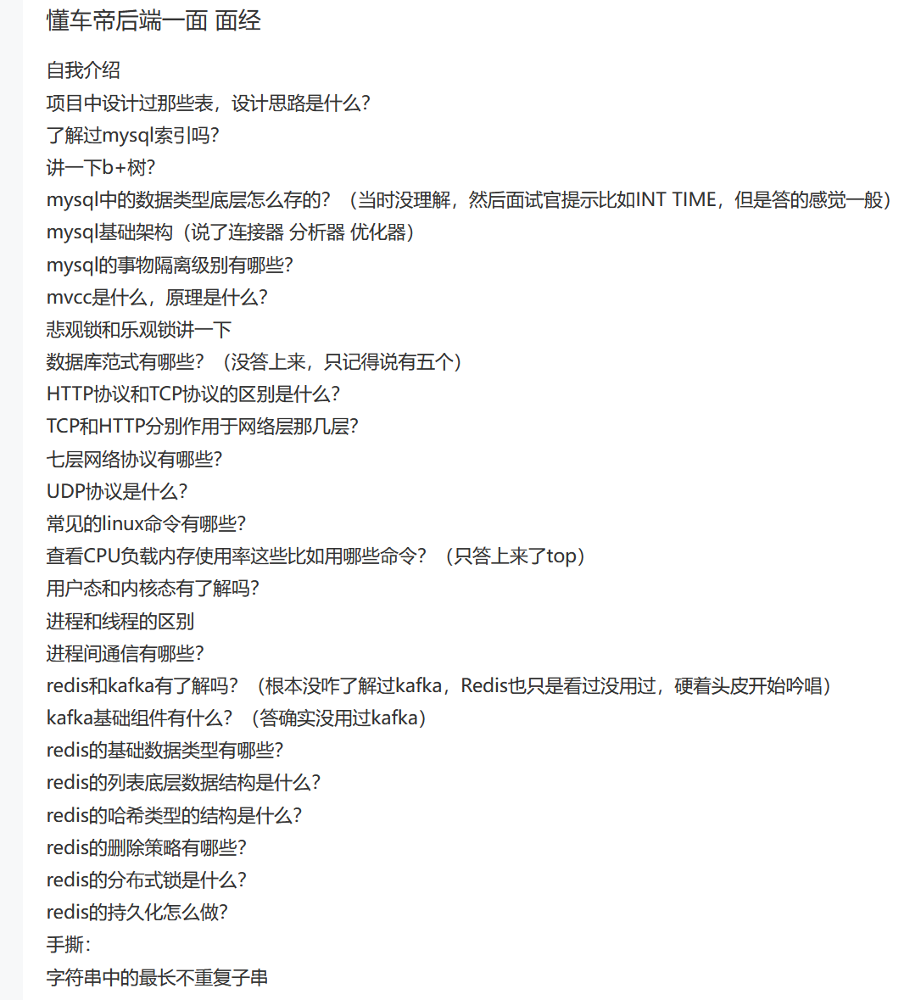

# 懂车帝后端一面 面经
自我介绍
## 项目中设计过哪些表，设计思路是什么？
- 字段符合三范式，不可分，唯一依赖，有依赖？
- 表之间需要考虑关联关系，小表驱动大表，表的数据量大小，是否需要片
- 索引，索引的选择，索引的类型，索引的使用场景
  
  设计过任务表，任务配置表，任务调度表
## mysql索引

聚簇索引，非聚簇索引；
唯一索引，主键索引，
复合索引(覆盖索引)；
普通索引，全文索引；

## B+树
叶子节点存储数据，非叶子节点存储索引；
- B+树的高度低，查询效率高；
- 支持范围查询；

## mysql中的数据类型底层怎么存的？（当时没理解，然后面试官提示比如INT TIME，但是答的感觉一般）
？？

## mysql基础架构
server层，引擎层；
优化器，连接器，执行器，

## mysql的事物隔离级别有哪些？
ru
rc
rr
序列化

## mvcc是什么，原理是什么？
readview undolog版本链

## 悲观锁和乐观锁讲一下
悲观锁是认为每次需要上锁和解锁
乐观锁通过版本号实现数据保护，

## 数据库范式有哪些？
三范式

## HTTP协议和TCP协议的区别是什么？
应用层和传输层

## 七层网络协议有哪些？
物理层 数据链路层 网络层 传输层 应用层 会话层 表示层

## UDP协议是什么？
无连接的数据报协议

## 常见linux命令有哪些？

## 查看CPU负载内存使用率这些比如用哪些命令？（只答上来了top）

## 用户态和内核态有了解吗？
用户态是程序员的可以接触的层级，不能访问关键内存，内核与用户转换需要消耗资源
内核态是操作系统内部保护的程序段，操作关键函数

