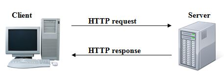
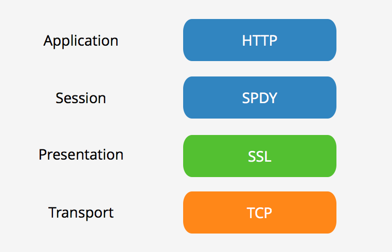
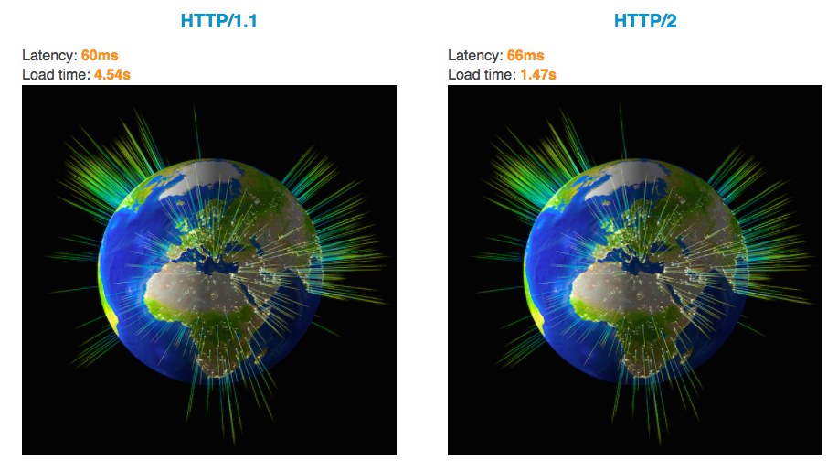
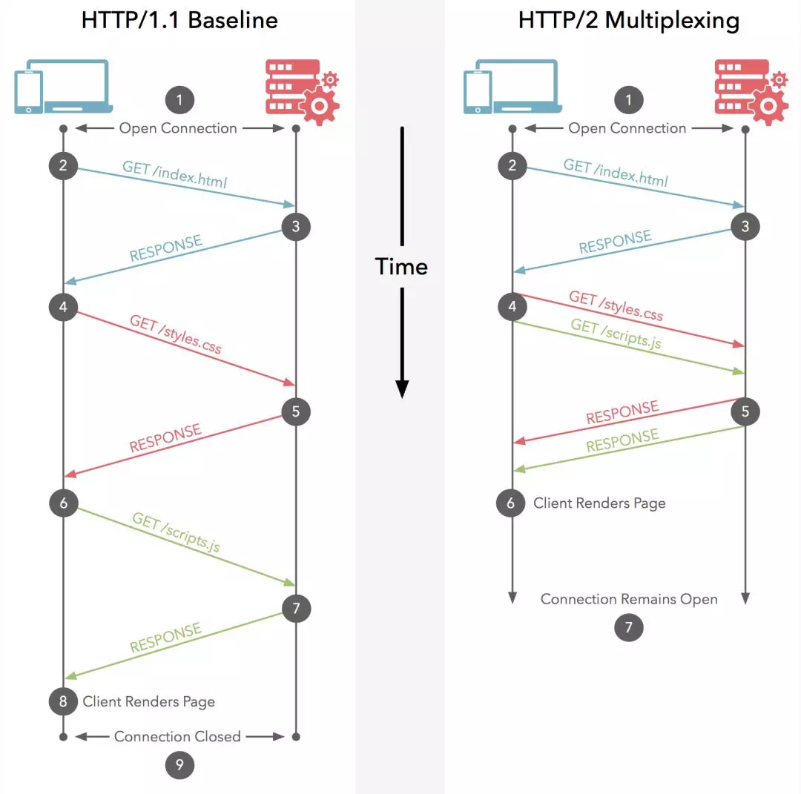
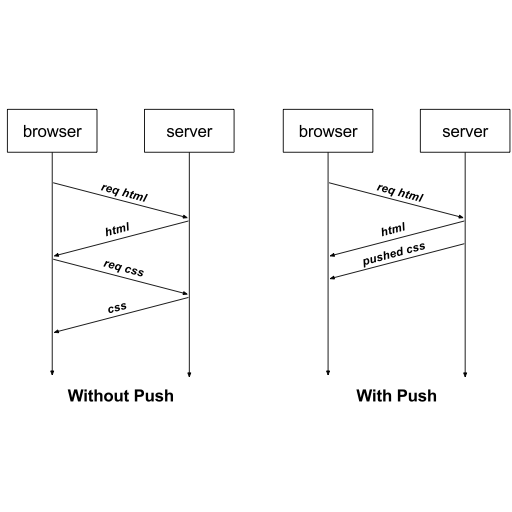
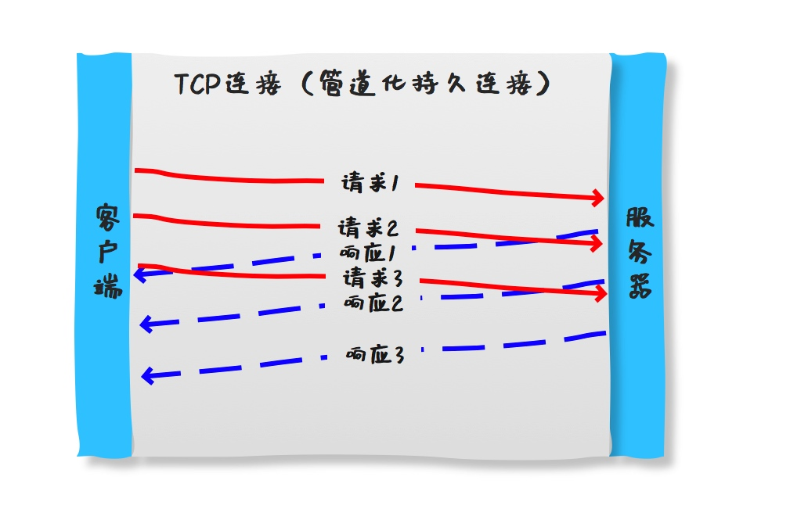

# ✅为什么需要HTTP/2，他解决了什么问题？

# 典型回答

HTTP/2主要是解决HTTP中存在的效率问题。它主要引入了二进制分帧、多路复用、header压缩、以及服务端推送的新特性，大大的提升了效率。

而且，在HTTP/2中还解决了一个重要的问题，那就是HTTP的队头阻塞问题。

# 扩展知识
## HTTP

超文本传输协议（英文：HyperText Transfer Protocol，缩写：HTTP）是一种用于分布式、协作式和超媒体信息系统的应用层协议。设计HTTP最初的目的是为了提供一种发布和接收HTML页面的方法。通过HTTP或者HTTPS协议请求的资源由统一资源标识符（Uniform Resource Identifiers，URI）来标识。

HTTP 协议是以 ASCII 码传输，基于请求与响应模式的、无状态的，建立在 TCP/IP 协议之上的应用层规范。。它不涉及数据包（packet）传输，主要规定了客户端和服务器之间的通信格式，默认使用80端口。

HTTP协议主要的版本有3个，分别是HTTP/1.0、HTTP/1.1和HTTP/2。HTTPS是另外一个协议，简单讲是HTTP的安全版。

### HTTP/1.0

1996年5月，HTTP/1.0 版本发布，为了提高系统的效率，HTTP/1.0规定浏览器与服务器只保持短暂的连接，浏览器的每次请求都需要与服务器建立一个TCP连接，服务器完成请求处理后立即断开TCP连接，服务器不跟踪每个客户也不记录过去的请求。

请注意上面提到的HTTP/1.0中浏览器与服务器只保持短暂的连接，连接无法复用。也就是说每个TCP连接只能发送一个请求。发送数据完毕，连接就关闭，如果还要请求其他资源，就必须再新建一个连接。

我们知道TCP连接的建立需要三次握手，是很耗费时间的一个过程。所以，HTTP/1.0版本的性能比较差。现在，随便打开一个网页，上面都会有很多图片、视频等资源，HTTP/1.0显然无法满足性能要求。

### HTTP/1.1

为了解决HTTP/1.0存在的缺陷，HTTP/1.1于1999年诞生。相比较于HTTP/1.0来说，最主要的改进就是引入了持久连接。所谓的持久连接就是：在一个TCP连接上可以传送多个HTTP请求和响应，减少了建立和关闭连接的消耗和延迟。

引入了持久连接之后，在性能方面，HTTP协议有了明显的提升，基本可以用于日常使用，这也是这一版本一直延用至今的原因。当然还是有些力不从心的，后面会详细介绍。

关于HTTP/1.0和HTTP/1.1还有些其他区别，这里就不展开介绍了。网上也很多资料，可以自行查阅。

### SPDY

虽然，HTTP/1.1在HTTP/1.0的基础上提供了持久连接，提升了很大的效率，但是，还是有很大的提升空间。

正所谓时势造英雄，正是因为HTTP存在着诸多不足，所以，才诞生了SPDY。2009年，谷歌公开了自行研发的 SPDY 协议，主要解决 HTTP/1.1 效率不高的问题。它的设计目标是降低 50% 的页面加载时间。SPDY主要提供了以下功能（后文介绍HTTP2的时候再详细介绍）：

+ 多路复用（multiplexing）。多个请求共享一个tcp连接。
+ header压缩。删除或者压缩HTTP头
+ 服务端推送。提供服务方发起通信，并向客户端推送数据的机制。

SPDY位于HTTP之下，TCP和SSL之上，这样可以轻松兼容老版本的HTTP协议。

实际上在 HTTP2 提出来之前，SPDY 流行了很长一段时间。当下很多著名的互联网公司都在自己的网站或 APP 中采用了 SPDY 系列协议（当前最新版本是 SPDY/3.1），因为它对性能的提升是显而易见的。主流的浏览器（谷歌、火狐、Opera）也都早已经支持 SPDY，它已经成为了工业标准。HTTP Working-Group 最终决定以 SPDY/2 为基础，开发 HTTP/2。

## HTTP/2

下图是Akamai 公司建立的一个官方的演示，主要用来说明在性能上HTTP/1.1和HTTP/2在性能升的差别。同时请求 379 张图片，HTTP/1.1加载用时4.54s，HTTP/2加载用时1.47s。

HTTP/2 是 HTTP 协议自 1999 年 HTTP 1.1 发布后的首个更新，主要基于 SPDY 协议。由互联网工程任务组（IETF）的 Hypertext Transfer Protocol Bis（httpbis）工作小组进行开发。该组织于2014年12月将HTTP/2标准提议递交至IESG进行讨论，于2015年2月17日被批准。HTTP/2标准于2015年5月以RFC 7540正式发表。

下面来看下，HTTP/2相对于HTTP/1.1有哪些改进：

### 二进制分帧

在HTTP/2中，在应用层（HTTP2.0）和传输层（TCP或者UDP）之间加了一层：二进制分帧层。这是HTTP2中最大的改变。HTTP2之所以性能会比HTTP1.1有那么大的提高，很大程度上正是由于这一层的引入。

在二进制分帧层中， HTTP/2 会将所有传输的信息分割为更小的消息和帧（frame）,并对它们采用二进制格式的编码。

这种单连接多资源的方式，减少了服务端的压力，使得内存占用更少，连接吞吐量更大。而且，TCP连接数的减少使得网络拥塞状况得以改善，同时慢启动时间的减少，使拥塞和丢包恢复速度更快。

### 多路复用

多路复用允许同时通过单一的HTTP/2.0连接发起多重的请求-响应消息。在HTTP1.1协议中，浏览器客户端在同一时间，针对同一域名下的请求有一定数量的限制，超过了这个限制的请求就会被阻塞。而多路复用允许同时通过单一的 HTTP2.0 连接发起多重的“请求-响应”消息。

HTTP2的请求的TCP的connection一旦建立，后续请求以stream的方式发送。每个stream的基本组成单位是frame（二进制帧）。客户端和服务器可以把 HTTP 消息分解为互不依赖的帧，然后乱序发送，最后再在另一端把它们重新组合起来。

也就是说， HTTP2.0 通信都在一个连接上完成，这个连接可以承载任意数量的双向数据流。就好比，我请求一个页面 [http://www.hollischuang.com](http://www.hollischuang.com) 。页面上所有的资源请求都是客户端与服务器上的一条 TCP 上请求和响应的！

### header压缩

HTTP/1.1的header带有大量信息，而且每次都要重复发送。HTTP/2 为了减少这部分开销，采用了HPACK 头部压缩算法对Header进行压缩。

### 服务端推送

简单来讲就是当用户的浏览器和服务器在建立连接后，服务器主动将一些资源推送给浏览器并缓存起来的机制。有了缓存，当浏览器想要访问已缓存的资源的时候就可以直接从缓存中读取了。

## HTTP队头阻塞

队头阻塞翻译自英文head-of-line blocking，这个词并不新鲜，因为早在HTTP/1.1时代，就一直存在着队头阻塞的问题。

但是很多人在一些资料中会看到有论点说HTTP/2解决了队头阻塞的问题。但是这句话只对了一半。

**只能说HTTP/2解决了HTTP的队头阻塞问题，但是并没有解决TCP队头阻塞问题！**

如果大家对于HTTP的历史有一定的了解的话，就会知道。HTTP/1.1相比较于HTTP/1.0来说，最主要的改进就是引入了持久连接（keep-alive）。

**所谓的持久连接就是：在一个TCP连接上可以传送多个HTTP请求和响应，减少了建立和关闭连接的消耗和延迟。**

引入了持久连接之后，在性能方面，HTTP协议有了明显的提升。

另外，HTTP/1.1允许在持久连接上使用请求管道，是相对于持久连接的又一性能优化。

所谓请求管道，就是在HTTP响应到达之前，可以将多条请求放入队列，当第一条HTTP请求通过网络流向服务器时，第二条和第三条请求也可以开始发送了。在高时延网络条件下，这样做可以降低网络的环回时间，提高性能。

**但是，对于管道连接还是有一定的限制和要求的，其中一个比较关键的就是服务端必须按照与请求相同的顺序回送HTTP响应。**

这也就意味着，如果一个响应返回发生了延迟，那么其后续的响应都会被延迟，直到队头的响应送达。这就是所谓的**HTTP队头阻塞**。

但是HTTP队头阻塞的问题在HTTP/2中得到了有效的解决。**HTTP/2废弃了管道化的方式**，而是创新性的引入了帧、消息和数据流等概念。**客户端和服务器可以把 HTTP 消息分解为互不依赖的帧，然后乱序发送，最后再在另一端把它们重新组合起来。**

**因为没有顺序了，所以就不需要阻塞了，就有效的解决了HTTP队头阻塞的问题。**

> 更新: 2024-09-13 21:31:44  
> 原文: <https://www.yuque.com/hollis666/ukxanr/hiqe1d>