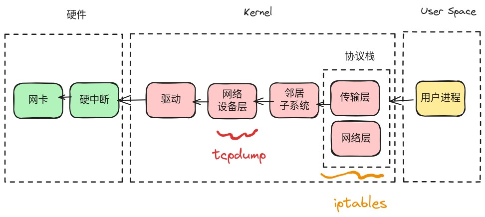
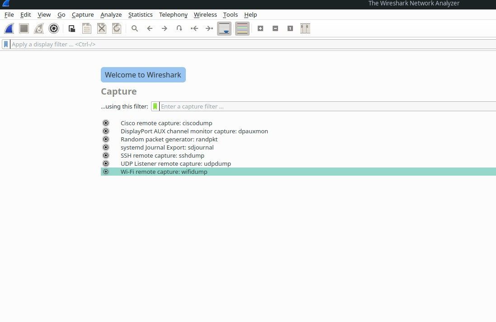
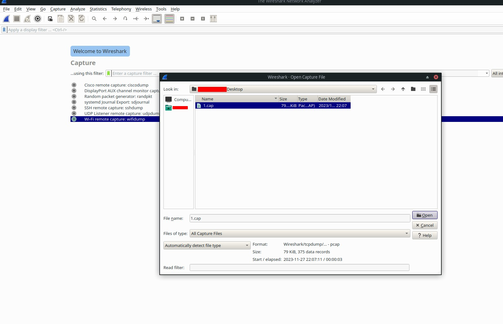
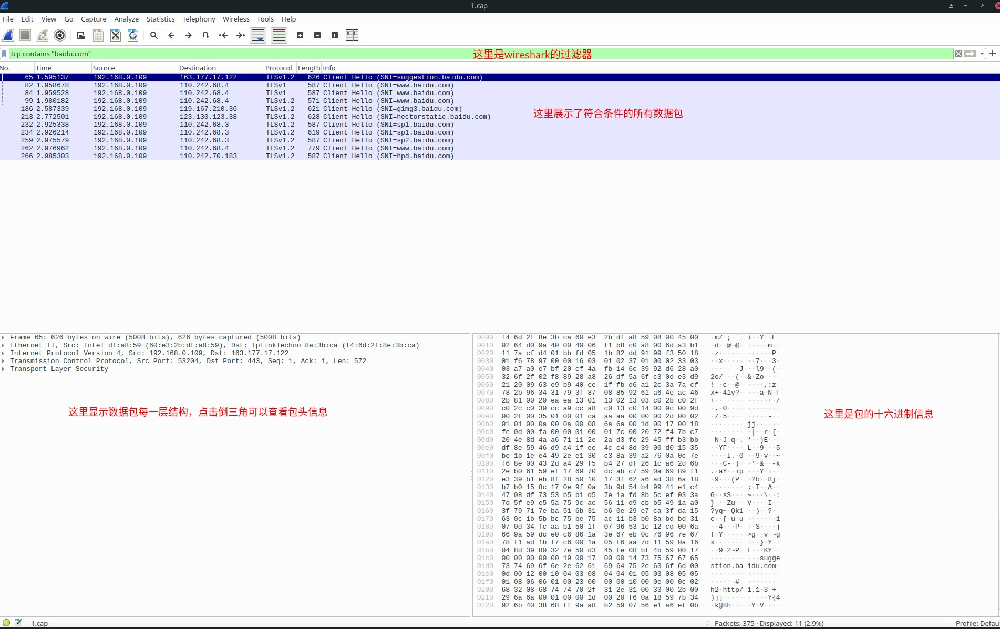
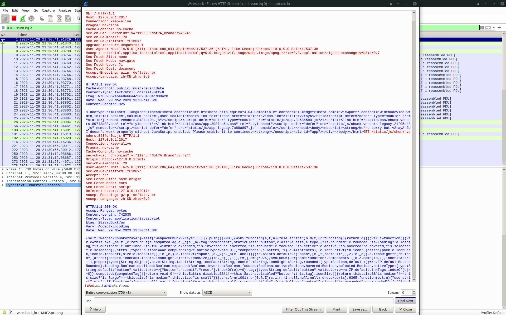
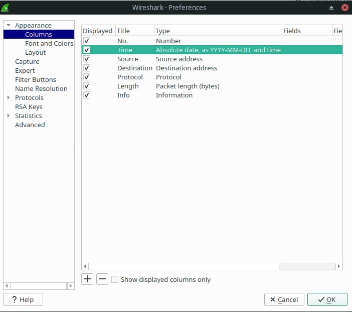
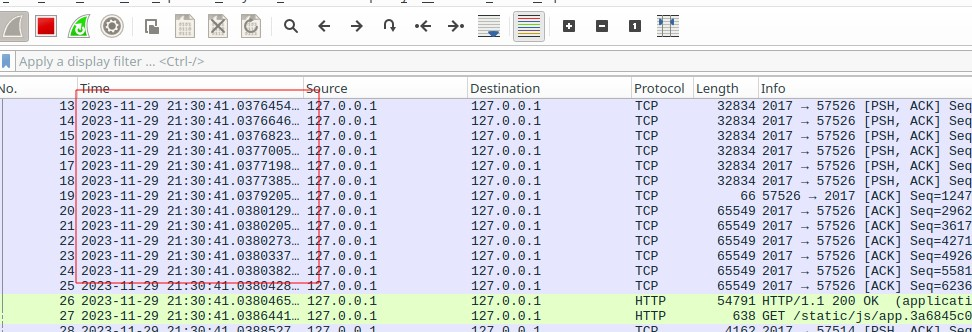

# ✅如何做网络抓包？

## 典型回答


抓包是指通过一些常用工具截获网络通信中的数据包，主要目的是排查通信过程中产生的问题，如：  
通过charles、chrome浏览器抓取http的数据包，分析请求和响应。  
通过tcpdump、wireshark抓取tcp、udp的数据包，分析协议、分析网络请求超时问题。


## 扩展知识


charles和chrome浏览器抓包都比较简单。这里只介绍tcpdump和wireshark的使用。  
tcpdump是命令行形式的。wireshark有一个不错的图形界面可以用来分析tcpdump抓包生成的文件，也可以直接进行抓包。  
一般情况下，我们的Linux服务器不会安装图形界面，所以抓包需要使用tcpdump命令生成文件，然后传到开发机上通过wireshark打开进行分析。  
大多数Linux发行版都会安装tcpdump，如果没装过可以使用如下命令进行安装：


```plain
yum install tcpdump -y #rhel、centos上安装
apt-get install tcpdump -y # ubuntu、debian上安装
pacman -S tcpdump -y # arch、manjaro上安装
```


在使用tcpdump之前，先简单了解其工作原理：

  
**Linux内核收包流程**


  
  
简单解释下发包流程：


1. 网络数据包到达网卡，网卡把RingBuffer中的数据包通过DMA映射到内核的RingBuffer上，然后发出硬中断
2. 硬中断处理函数把RingBuffer数据包挂载到当前CPU核关联的poll_list双向链表中，随后发起软中断
3. kosoftirqd内核线程处理软中断，执行网络子系统启动时注册的处理函数net_rx_action
4. nex_rx_action函数调用网卡注册的poll函数把poll_list中的数据包摘下来，同时利用网卡GRO特性将小包合并成大包。这里就是图中的驱动部分
5. 驱动处理完成后要把数据包送入协议栈，在这之前还要做一些处理，图中标记的网络设备层就是干这事的，tcpdump就是在这里拦截数据包（之所以叫网络设备层，因为内核函数是以netif_receive开头的）。
6. 协议栈会对数据包拆包，即根据tcp、udp、ip等协议规则进行处理。同时这里会执行NF_HOOK函数，就是iptables过滤链。
7. 协议栈处理完成后，数据包放入接收队列，并唤醒用户进程


**这里的一个重点：tcpdump在收包场景中位于iptables之前，所以能抓到被iptables INPUT链拦截的数据包。**


**Linue内核发包流程**


  
  
简单解释下收包流程：


1. 发包是收包的逆序过程（当然内核的代码肯定是不同的，这里只是说流程是逆序的）
2. 收发包流程差异点在于网络设备层和协议栈之间多了个邻居子系统，其作用是发起ARP寻找目标MAC地址
3. 发包是一个主动行为，所以不需要软中断，直接调用网卡驱动，驱动向网卡发包即可


**这里的一个重点：tcpdump在发包场景中位于iptables之后，所以不能抓到iptables OUTPUT链拦截的数据包。**


数据包在内核里转换为`struct sk_buff`结构体，所以tcpdump处理的就是这个结构体。


有了以上基础知识，再来看看tcpdump怎么使用。tcpdump有很强大的过滤规则，如：过滤给定目标ip和端口的数据包、过滤特定协议的包等。这里给出常用的使用方法：


```plain
tcpdump -i eth0 -nn -w 1.cap //-i eth0是指抓eth0网卡的包；-nn表示不解析域名和端口 这样方便查看结果；-w 1.cap是将抓到的包写到当前目录1.cap这个文件中

tcpdump -i eth0 -nn -w 1.cap tcp and host 10.182.1.1 and port 80 or port 443 //-w 1.cap后面跟着的tcp代表只抓tcp包；and和or组合多个条件；host 10.182.1.1代表只抓取这个ip的数据包（包括来自或发给这个ip的包）；port 80和port 443代表只抓取这俩个端口的包（包括来自或发给这俩个端口的包）

tcpdump -i eth0 -nn -w 1.cap tcp and dst 10.182.1.1 and dst port 80 or dst port 443 // dst 10.182.1.1代表只抓取这个ip的包，dst port代表只抓取目标端口为443的包
```


tcpdump过滤规则可以写的很复杂，不过如果不是产生很多的包，建议使用简单规则抓下来后传回开发机，通过wireshark进行分析。


> 题外话，从服务器传到开发机有很多方法，如：开发机用nc启动一个端口，服务器通过nc把包文件传输到开发机。也可以使用scp命令传输。
>


wireshark需要下载，[官网地址](https://www.wireshark.org/)

  
wireshark有着直观且美观的图形界面，支持丰富的通信协议（甚至可以抓蓝牙、串口的包），强大的过滤器和数据流跟踪功能。以下介绍一些常用技巧：


1.  选择本机某个网卡进行抓包

  
 

2.  点击菜单栏File->Open 可以打开tcpdump保存的文件  
 



3.  可以通过过滤器过滤数据包  



wireshark的过滤器也支持算数运算符和逻辑运算符：


+ 算数运算符：==、>、<、<=、>=、!=，也可以写成eq、gt、lt、ge、le、ne
+ 逻辑运算符：&&、||、!，也可以写成and、or、not


同时可以使用()控制规则的优先级


常用的过滤器写法：


+ tcp contains '关键词'，过滤tcp报文中包含关键词字符串的数据包
+ http，过滤http协议
+ ip.addr，过滤指定ip地址的数据包，如：ip.addr == 192.168.1.1
+ ip.src，过滤指定源ip地址的数据包，如：ip.src == 192.168.1.1
+ ip.dst，过滤目标ip地址的数据包，如：ip.dst == 192.168.1.1
+ tcp.port，过滤指定tcp端口的数据包，如tcp.port == 443
+ tcp.srcport，过滤指定源tcp端口的数据包，如：tcp.srcport == 443
+ tcp.dstport，过滤指定目标tcp端口的数据包，如：tcp.dstport == 443
+ http.request.method，过滤指定的http请求方式数据包，如：http.request.method == 'get'
+ http.request.uri，过滤指定http请求地址的数据包，如：http.request.uri matches 'baidu.com'，注意matches是使用正则表达式模糊匹配
+ http contains '关键词'，过滤http包中指定关键词的数据包，如：http contains 'User-Agent:xxx'


跟踪数据流，选中一个包，右键follow->tcp stream查看tcp的请求和响应，follow->http stream查看http的请求和响应  



修改显示的时间格式，菜单栏Edit->Preferences->Appearance->Columns，修改Title为Time的Type列。这样有助于分析请求的耗时和发生时间  
  






总结一下，掌握抓包更有利于分析问题，包括：


1. 新接手的代码，线上出现问题，抓包分析请求参数、响应结果，对照代码分析问题
2. 调用第三方接口时，分析请求参数、响应结果是否正常
3. 接口性能抖动、网络问题都可以通过抓包排查
4. 分析某个通信组件的协议，深入理解其原理


wireshark还有很多技巧，可以参考《Wireshark网络分析就这么简单》这本书。


> 更新: 2024-09-13 21:32:21  
> 原文: <https://www.yuque.com/hollis666/ukxanr/uv5yhtvvlff1np5q>